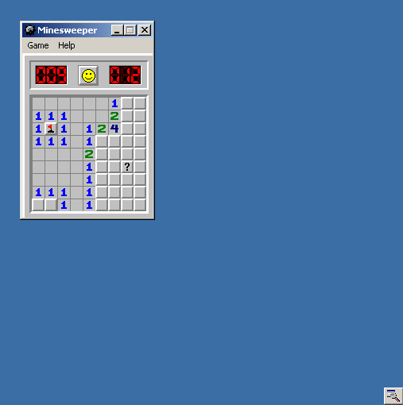
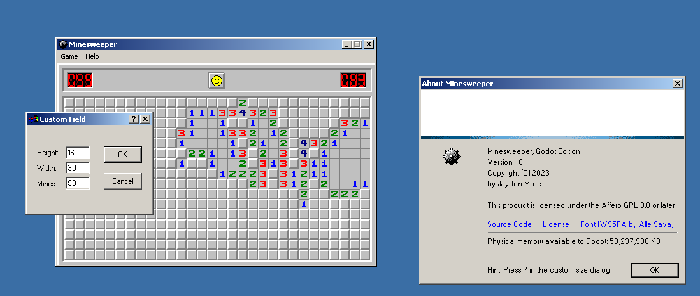
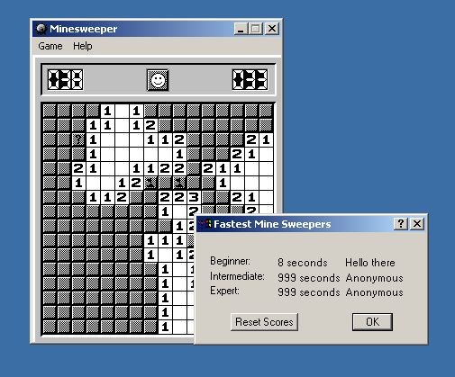

# Minesweeper, Godot Edition

This is a recreation of Minesweeper from Windows 2000, written for Godot 4.1 
using GDScript (for web export).

https://minesweeper.jayd.ml

AGPL v3 licensed

## Goals
- Be as faithful as reasonable
- Pixel perfect where possible

## Screenshots

## Features
- Original graphics, look and feel, and sound
- Basic, Intermediate, Expert, and Custom game modes
- Toggle-able marks, color mode, and sound
- Timer, mine counter
- High scores and best times dialog, all are draggable. 
- High scores are persisted
- Original easter eggs/cheats
  - `XYZZY + Shift Enter` enables the cheat pixel in the upper left
  - Left click and right click + escape in the game window stops the clock
- New cheats:
  - Click the `[?]` button in the custom size dialog to disable limits
- Options are saved and persisted between game loads
- Multiple DPI options (bottom right corner)
- Help and about modals

### Other Behaviors:

- You can't lose on your first click (like original)
- Only 2^16 possible game boards (like original)
